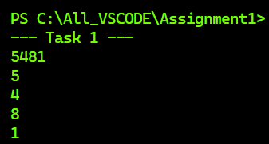
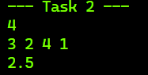
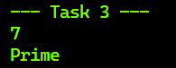
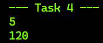
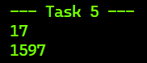
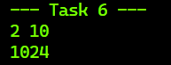
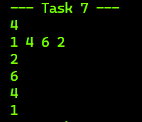
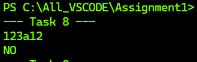
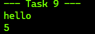
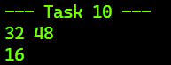

# Assignment #1 — Recursion

**Student:** Korostylev Dmitriy
**Group:** SE2513

-----

## Objective

The goal of this assignment is to practice recursion in Java by solving problems involving numbers, sequences, and strings — without using any loops.

-----

## Part 1 — Recursion with Numbers

### Task 1 — Print Digits of a Number

**Description:** A recursive function that prints every digit of a number on a separate line.

**Logic:** If the number is less than 10, print it directly (base case). Otherwise, recursively call the function with `a / 10` first, then print `a % 10`.

```java
public static void PrintDigit(int a) {
if (a < 10) {
System.out.println(a);
return;
}
PrintDigit(a / 10);
PrintDigit(a % 10);
}
```

**Example:**

|Input|Output |
|-----|----------------------------|
|5481 |5 4 8 1 (each on a new line)|



-----

### Task 2 — Average of Elements

**Description:** A recursive function that calculates the sum of list elements, then divides by count to get the average.

**Logic:** Base case returns 0 when index reaches the end. Each call adds the current element and recurses with `index + 1`. The average is computed in `main`.

```java
public static int AverageOfElements(List<Integer> list1, int index) {
if (index == list1.size()) return 0;
return list1.get(index) + AverageOfElements(list1, index + 1);
}
```

**Example:**

|Input |Output|
|-----------|------|
|4 → 3 2 4 1|2.5 |



-----

### Task 3 — Prime Number Check

**Description:** A recursive function that checks whether a number is prime.

**Logic:** Checks divisibility starting from 2 up to `√n`. If any divisor is found, returns “Composite”. If we pass `√n`, returns “Prime”.

```java
public static String PrimeNumberCheck(int c, int index) {
if (index > Math.sqrt(c)) return "Prime";
if (c % index == 0) return "Composite";
return PrimeNumberCheck(c, index + 1);
}
```

**Example:**

|Input|Output |
|-----|---------|
|7 |Prime |
|10 |Composite|



-----

### Task 4 — Factorial

**Description:** A recursive function that calculates n! (factorial).

**Logic:** Base case: `n <= 1` returns 1. Otherwise returns `n * Factorial(n - 1)`.

```java
public static long Factorial(int d) {
if (d <= 1) return 1;
return d * Factorial(d - 1);
}
```

**Example:**

|Input|Output|
|-----|------|
|5 |120 |



-----

## Part 2 — Recursion with Sequences

### Task 5 — Fibonacci Number

**Description:** A recursive function that finds the n-th Fibonacci number.

**Logic:** Base cases: `F(0) = 0`, `F(1) = 1`. Otherwise: `F(n) = F(n-1) + F(n-2)`.

```java
public static int FibonacciNumber(int e) {
if (e == 0) return 0;
if (e == 1) return 1;
return FibonacciNumber(e - 1) + FibonacciNumber(e - 2);
}
```

**Example:**

|Input|Output|
|-----|------|
|5 |5 |
|17 |1597 |



-----

### Task 6 — Power Function

**Description:** A recursive function that calculates `a^n`.

**Logic:** Base case: `g == 0` returns 1. Otherwise returns `f * PowerOf(f, g - 1)`.

```java
public static int PowerOf(int f, int g) {
if (g == 0) return 1;
return f * PowerOf(f, g - 1);
}
```

**Example:**

|Input|Output|
|-----|------|
|2 10 |1024 |



-----

### Task 7 — Reverse Output

**Description:** A recursive function that prints a list of numbers in reverse order.

**Logic:** Starts from the last index and prints the current element before recursing to the previous one. Base case: index < 0.

```java
public static void ReverseOutput(int index, List<Integer> list2) {
if (index < 0) return;
System.out.println(list2.get(index));
ReverseOutput(index - 1, list2);
}
```

**Example:**

|Input |Output |
|-----------|-------|
|4 → 1 4 6 2|2 6 4 1|



-----

## Part 3 — Recursion with Strings

### Task 8 — Check Digits in String

**Description:** A recursive function that checks whether a string contains only digits.

**Logic:** Base case: reached end of string → return true. If current character is not a digit → return false. Otherwise recurse with `index + 1`.

```java
public static boolean CheckDigits(String line, int index) {
if (index == line.length()) return true;
if (!Character.isDigit(line.charAt(index))) return false;
return CheckDigits(line, index + 1);
}
```

**Example:**

|Input |Output|
|------|------|
|123456|Yes |
|123a12|No |



-----

### Task 9 — Count Characters in a String

**Description:** A recursive function that counts the number of characters in a string.

**Logic:** Base case: index equals string length → return 0. Otherwise return `1 + recurse(index + 1)`.

```java
public static int CheckDigits(int index, String str) {
if (str.length() == index) return 0;
return 1 + CheckDigits(index + 1, str);
}
```

**Example:**

|Input |Output|
|---------|------|
|hello |5 |
|recursion|9 |



-----

### Task 10 — Greatest Common Divisor (GCD)

**Description:** A recursive function that finds the GCD of two numbers using the Euclidean Algorithm.

**Logic:** Base case: `b == 0` → return `a`. Otherwise return `GCD(b, a % b)`.

```java
public static int GCD(int a, int b) {
if (b == 0) return a;
return GCD(b, a % b);
}
```

**Example:**

|Input|Output|
|-----|------|
|32 48|16 |
|10 7 |1 |



-----

## Summary

In this assignment I implemented 10 recursive functions in Java covering three categories: numbers, sequences, and strings. The key challenge was thinking in terms of base cases and recursive calls instead of loops.

The most interesting task was the prime number check — using `Math.sqrt()` as the stopping condition makes the recursion efficient. The reverse output task also helped me understand how the call stack naturally reverses order depending on whether you print before or after the recursive call.

All tasks follow the rules: no loops (`for`, `while`, `do-while`) were used anywhere in the solution.
P.S. Ive used loops only in the main func. Not sure is that a prohoibited move. But all the task func Ive complited without loops.
Thank u.